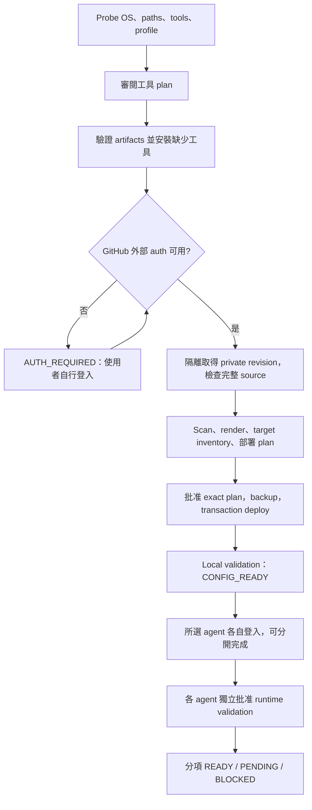

# Phase 4A — Bootstrap & Multi-machine 設計

> Current requirement (2026-09-25): [agent-driven memory checkpoints](../sync-v2.md#agent-driven-memory-checkpoints-2026-09-25)
> replace the goal of pre-CLI automatic family tracking. Bootstrap is separate from
> daily sync. The material below is retained historical research/status, not current
> authorization to continue guardian/retirement work. Existing barriers/tests remain;
> the historical loading gate is still BLOCKED. No production deployment or 4H.

4A 設計及 [generation cohort loading contract](phase-4-generation-cohorts.md) 已接受。
最新授權允許連續隔離 4B–4G，不要求短期 lease、hooks、hot reload 或 snapshot paths。
本輪 enrollment consistency 已修復；native guardian 仍缺 descendants evidence。
[最新兩個 blocker 修復／診斷紀錄](phase-4-blocker-repair.md) 為目前狀態，loading gate
與 4B–4G 尚未 PASS。本輪僅此窄化修復，不擴張架構或其他 Phase 4 工作。
不部署 production、不修改 private、不 commit/push、不執行 4H。

以下保留 4A 設計契約；其中「尚未實作」與 design-only scope 是當時狀態，
目前已完成三 profiles／部分 toolchain、PATH、cohort/v2 integration，不能據此
推定完整 fresh-machine／statusLine qualification 已通過。

## 目標與成功定義

新 macOS 電腦以一次選擇 profile、一次審閱具體安裝／部署 plan，完成工具與
portable configuration 建置。Apple 系統安裝提示及 GitHub／Claude／Codex 登入
各自保留為必要的人工作業，不能以「一鍵」為由自動接受權限或處理 credentials。

必須支援三種 profile；六個 shared skills 均為同一份來源：`dotfiles-sync`、
`d3-component`、`deploy`、`excel-import`、`review`、`supabase-migrate`。

| Profile | 工具依賴 | Selected targets（設計數量） |
| --- | --- | --- |
| `claude` | common tools + Claude；不需要 Codex | 14：core 5 + Claude 9 |
| `codex` | common tools + Codex；不需要 Claude、Node/statusLine 或 Claude settings | 12：core 5 + Codex 7 |
| `claude-codex` | common tools + 兩個獨立 CLI 分支 | 21：core 5 + Claude 9 + Codex 7 |

Core 5 是 neutral engine/scanner 的部署檔案；Claude 9 是 instructions、六 skills、
settings 與 legacy forwarding entrypoint；Codex 7 是 instructions 與六 skills。
**12-target codex-only 已在 public isolated implementation 實作並測試；production 未部署。**
未選 agent 的 CLI 是否安裝、登入、訂閱都不 probe、不 gate；不要求其檔案存在。

成功狀態分開記錄，不能混稱 PASS：

| 狀態 | 必要證據 |
| --- | --- |
| `TOOLS_READY` | 所選工具的版本、來源／完整性、架構、實際 PATH 和執行能力驗證 |
| `CONFIG_READY` | repo identity、scanner、bounded render/deploy、profile status、zero drift 通過 |
| `RUNTIME_PENDING_AUTH` | 上述通過，但使用者尚未登入；不是 runtime PASS |
| `RUNTIME_BLOCKED` | 已登入但模型／credits／network 或產品載入失敗；保留配置，報告原因 |
| `READY` | 選定 profile 的真實 agent rules／六 skills／sync runtime 驗證通過，副作用檢查完成 |
| `BLOCKED` / `RECOVERY_REQUIRED` | 安全條件不符或交易中斷；不得接續寫入或宣告成功 |

所有結果以 `core`、`claude`、`codex` 三個 component 分開保存。總結可以是
`PARTIAL_READY`，例如 `core=CONFIG_READY, codex=READY, claude=RUNTIME_PENDING_AUTH`；
不得用 overall failure 掩蓋已可用的另一 agent，也不得把 partial 稱為所有 agent PASS。
Core 的 scanner/render/status/plan/in/push 不呼叫任一 agent CLI 或模型服務，不查訂閱。
GitHub private remote access 是 network sync 自身的依賴；offline status 不要求 GitHub login。
六 skills 的 discovery 不執行實際 deploy/database 等工作；Docker／Supabase 等業務工具
只在使用該 skill 任務時成為依賴，不得把它們或另一 agent CLI 變成 Shared Core prerequisite。

Dual profile 某 agent 缺 CLI、安裝失敗、未登入、沒有訂閱或 quota，不得阻擋另一 agent
的 tools/config/runtime gate 或 Shared Core 部署／sync。可先部署其純文字 portable targets，
但 tools/runtime 分別記 pending/blocked。CLI 安裝失敗只停止該安裝分支，不回滾已通過的
另一分支。只有 shared source/scan/layout/transaction 安全失敗才阻擋共同寫入。
若尚未部署某 agent scope，receipt 必須如實記錄 active subset 與 pending scope；
日常 status/plan/in/push 使用已成功部署的 active profile。這不是允許忽略「曾部署後
被刪除」的 targets：後者仍是 drift，必須拒絕，不能偷偷縮小 active profile。只有工具／
auth 不可用時，完整 portable targets 仍可正常部署，所以不需要縮小 target mapping。

Idempotent 定義：相同 bootstrap release、工具 lock、profile、repo revision 和
未變的本機狀態，第二次執行不改 source、HEAD/index、targets、工具、shell 設定、
profile receipt 或 ownership。可另增明確標示的診斷紀錄；不以 timestamp 重寫完成紀錄。
Fail-safe 不等於所有 OS／package-manager 操作可以原子 rollback。

## 已有能力與需要補齊的能力

依據 public Phase 2.7 engine、Phase 3 publication 紀錄與既有 fixture，而非重新
讀取 production private payload。新設計不得將以下缺口誤標為現成功能：

| 現況 | Phase 4 契約／後續工作 |
| --- | --- |
| `sync-write.py` 對 selected targets 做必須存在的 snapshot | 新機需要獨立的 first-deployment transaction；不能用空檔假裝 baseline，也不能用 legacy migration 冒充 fresh install |
| `sync-migrate.py` 處理 legacy conversion／Claude-only source expansion | full dual source 已在 main 的新機 profile promotion 是另一種操作；不得再次增加／改寫 source wrappers |
| 現有 profiles 只有 `claude` / `claude-codex` | 增加真正 codex-only mapping、renderer、scanner、status/in/push；不得繼承必須存在 Claude settings／legacy wrapper 的假設 |
| `mapping(profile)` 同時控制 source history 與 targets | 分離 repository scope 與 deployment profile：full dual repo 的歷史需完整掃描，單 agent profile 只讀／寫所選 targets |
| `history()` 拒絕 profile allowlist 外變更 | 現在 Claude-only client 可能拒絕只改 Codex 的 commit；未補測前不得宣稱混合 profile 日常 sync 已支援 |
| 原始 chezmoi source 同時有 Claude／Codex wrappers | 本機選 profile 不會自動改變 stock `chezmoi apply`；不可把 bare apply/update 當 profile-safe 入口 |
| v2 是固定 renderer／mapping，不支援任意 chezmoi template 或 install hooks | bootstrap 必須從可信 release 執行；clone 後先做結構／bytes 驗證，不執行下載 repo 的 hooks／scripts |
| Git 隔離流程使用 `--no-lazy-fetch`；Python 3.9+ 必須存在 | Apple 提供的 Git／Python 不可假定足夠；加入 capability 和 runtime dependency gates |
| 現有 Claude settings/statusLine 可能依賴 npx、widget config、主機路徑 | 保留已接受 settings；新增 bootstrap dependency/portability audit，不直接複製舊機器 runtime 配置或靜默重寫設定 |

對應程式：[mapping](../examples/chezmoi/.chezmoitemplates/ai/shared/scripts/scan-secrets.py)、
[write/history](../examples/chezmoi/.chezmoitemplates/ai/shared/scripts/sync-write.py)、
[migration](../examples/chezmoi/.chezmoitemplates/ai/shared/scripts/sync-migrate.py)。

## Trust、source 與本機 state 邊界

唯一 portable authority 仍是 private `OWNER/dotfiles` 的已審核 main commit。
起始已接受 revision 為 `19a27374a0ff2d1d4739f3d9a9c6bd2e46471ab9`；它是 review anchor，
不是永遠固定的 latest。Bootstrap 公開 release + toolchain lock 則是執行程式的 authority，
不得由剛 clone 的 repo 自動選出／更新 bootstrap executable。

預設 source 為 `$HOME/.local/share/chezmoi`、destination 為 `$HOME`。
沿用 Phase 2.7 root/symlink/hardlink/Git metadata 保護；只操作 exact mapping。
不遞迴遍歷 HOME、不以 glob 匯入 `.claude`／`.codex`，不運行 `chezmoi add -r`。
Git repo 必須 regular、non-shallow、無 linked worktree／alternates／submodules；
clone 只建立 checkout，不執行 init template、externals、filters 或 source hooks。
除了 mapping，只允許 inventory 已確認且不部署的 README；未知 source 格式先拒絕。

| 類別 | 管理方式 |
| --- | --- |
| Shared rules、六 skills、adapters、v2 engine、已批准 Claude settings、metadata | 來自 private source；與 upstream bytes/modes 一致 |
| Profile、工具 lock identity、安裝 ownership、validation receipts、PATH fragment | 本機 bootstrap metadata；不放進 private source 或 sync mapping |
| Claude/Codex auth、Keychain、SSH keys／agent、GitHub credential helpers、tokens | 外部登入流程負責；bootstrap 不讀取、備份、export、傳送或寫入 credential payload |
| Codex config/project trust、sessions、history、SQLite、Claude runtime/cache、模型偏好 | 不自動納管；既有檔案不改寫，不「清理」；產品自行產生的 state 不能列為 portable output |

Codex config 可能同時含偏好、trust 與敏感值。Bootstrap 不備份整份 config；
僅記錄必要的存在性／mode／hash，允許的相容性檢查在記憶體進行，不輸出內容。
若產品 runtime 測試改變它，停止並精確報告，不自動接受或還原（Phase 3 的 trust
cleanup 授權不延伸至新機）。Auth 檔連 hash 都不需要收集。日誌不捕捉 env、
credential-helper 輸出、login flow、account identity、device code 或 raw model transcript。

計畫、rollback 與 receipts 放在 HOME/source 外的 durable owner-private 位置，建議
`/Users/Shared/ai-agent-bootstrap/<uid>/runs/<run-id>`，父目錄 ownership/type 必須核對，
0700 directories／0600 payloads，原子建立且拒絕 symlink／已存在的 run directory。
若不可建立，要求明確提供合規外部路徑；不默默降級至 HOME 或臨時目錄。
多使用者不可共用 receipt。備份只含 allowlisted portable files，必須先通過 secret scan；
若現有 target 含 secret，停止，不將其複製到 backup。

## 工具與可重複安裝策略

建立 versioned bootstrap release 與 `toolchain.lock`（4B 以後才實作）。Lock 列明
每個受支援 OS/CPU 與 agent 分支的 version、official artifact URL、SHA-256、簽章驗證方法、
依賴 closure、installer identity、安裝位置、health command、rollback 能力。
不能在 apply 時重新解析 `latest`；lock 的 hash 納入 plan。下載與所有依賴驗證完成
後才安裝。不可驗證／已下架／版本不符即 BLOCKED，不 fallback 到未審核最新版。

| 工具 | 設計決策 |
| --- | --- |
| Git | 重用通過完整 capability check 的既有 Git；否則提出受控 Homebrew Git 安裝。需支援 `--no-lazy-fetch` 等實際 engine 命令，不能只測 `git --version` |
| chezmoi | 官方 tagged release binary，鎖定版本與平台 digest；不使用浮動 install script |
| Gitleaks | **精確 8.30.1**；官方 Darwin archive + reviewed SHA-256；另外核對實際執行 binary、version 和 scanner protocol |
| Claude Code | 僅 `claude`／`claude-codex` 安裝；選定官方、可驗證、明確版本的安裝路徑；預設設計採受控 Homebrew cask，避免 native updater 默默改動已驗證版本；existing native/npm installation 不改 ownership/updater |
| Codex CLI | 官方 tagged standalone binary，按架構與 digest 鎖定；僅 `codex`／`claude-codex` 安裝，不為 CLI 額外引入 npm dependency |
| Python | engine 所需 3.9+；重用相容版本或列為受控安裝依賴，不假定 macOS 內建 |
| Node/npm、statusLine package | 僅 Claude 分支；依 portable settings 實際需求加入 lock；不能因 Claude native binary 不需 Node 就忽略 npx statusLine |

Gitleaks archive 已有公開 digest：Darwin arm64
`b40ab0ae55c505963e365f271a8d3846efbc170aa17f2607f13df610a9aeb6a5`；Darwin x64
`dfe101a4db2255fc85120ac7f3d25e4342c3c20cf749f2c20a18081af1952709`。
來源為 [官方 v8.30.1 release](https://github.com/gitleaks/gitleaks/releases/tag/v8.30.1)。
其餘工具 exact versions／digests 必須於 4B compatibility review 填完；4A 不猜測
新機適用版本，也不把 Phase 3 單機版本當成所有 macOS 的 qualification。

Homebrew 不是 lockfile 的替代品。首次安裝需審閱其完整 dependency transaction、
formula/cask revision 與 artifact hashes；禁止 blanket `brew upgrade`／cleanup。
若固定 revision/bottle 在該 OS 無法重現，BLOCKED，不臨時 source-build 或換最新版。
CLT/Homebrew 本身若不存在，顯示獨立 prerequisite checkpoint，使用官方 OS／installer
流程，由使用者批准必要系統提示，再重新 probe；不靜默 sudo、接受 license 或改安全設定。
系統 prerequisite／套件管理器不是可完全回滾的 bootstrap file transaction。

工具安裝／掃描有 branch-local 與 shared 兩種失敗域：Claude/Codex artifact 失敗只停止
該分支；Git/Python/chezmoi/Gitleaks 或 shared source integrity 失敗才阻擋共同 deployment。
可用另一分支的 receipt 不因失敗被抹除，重跑可僅接續失敗分支。

先以 macOS arm64 為 qualification target；Intel x64 必須有獨立 fixture/runtime
證據才列為支援。原生 CPU、實際 process architecture、最低 OS、Rosetta 混用都需
probe；不自動安裝 Rosetta。4A 未宣告任何新機矩陣已 PASS。

Bootstrap 自管 binary 放在版本化本機目錄，必要時以可回滾 launcher 指向已驗證版本。
既有同名 executable／symlink 一律先識別 provenance，不覆蓋、不搶 PATH。
PATH 變更是獨立明列的 machine-local action：只對已批准的 startup file 加入唯一
managed block，保留原 bytes、可移除自己的 block，不覆蓋整份 shell config。
重跑 block 不重複；若使用者改過 block 或發現 PATH shadowing，停止。
驗證 login zsh、interactive zsh、inherited sh 的工具解析；已啟動的 GUI/agent session
可能需使用者重啟，不宣稱修改 PATH 能更新所有既有 process。

官方依據：[Git/macOS](https://git-scm.com/install/mac)、
[Homebrew requirements](https://docs.brew.sh/Installation)、
[chezmoi install](https://www.chezmoi.io/install/)、
[Claude 安裝與更新](https://code.claude.com/docs/en/setup)、
[OpenAI Docs：Codex CLI](https://learn.chatgpt.com/docs/codex/cli)。
安裝 native Claude 的單次 version pin 不會自動關閉其日後 updater；不能以此聲稱永遠鎖版。

## Authentication：明確的人工作業邊界

1. GitHub：bootstrap 工具安裝可先完成；取得 private repo 前，使用者自行建立有效 SSH
   agent session 與核對 GitHub host key。Bootstrap 不生 key、不讀 Keychain、不寫
   known_hosts、不使用 `StrictHostKeyChecking=no`，也不從其他電腦搬 credentials。
2. Repo transport 採現有 v2 可支援的 explicit SSH URL
   `ssh://git@github.com/OWNER/dotfiles.git`；透過已存在 agent、strict host verification
   做 noninteractive read access probe。只有成敗，原始 stderr 不入 log。
   GitHub HTTPS helper 能 clone 不代表 v2 HTTPS 可以 authenticated sync；本版不承諾該路徑。
3. Claude／Codex 登入在 `CONFIG_READY` 後，使用者直接透過產品官方 login 流程操作。
   Bootstrap 不呼叫 login、不代貼 token/device code、不收 API keys、不替使用者登出。
   CLI 本身可能把 credentials 留在 Keychain 或本機 auth file；這不是 bootstrap 管理資料。
   兩個登入獨立完成，不用一個 agent 的 account／subscription 判斷另一個 agent；不自動購買訂閱。
4. 使用者完成登入後，另行同意 runtime smoke test（可能消耗 quota），才驗證真實 agent。
   登入成功、靜態 files 正確、模型成功回應是三件不同的事。

依據 [OpenAI Docs：authentication 與本機 credential storage](https://learn.chatgpt.com/docs/auth)。
若 access probe 失敗，停在 `AUTH_REQUIRED`，不要反覆自動嘗試或更換 authentication method。
必要的人工量是 profile/plan 決策、OS prerequisite 提示及選定產品各自登入；不承諾零互動。

## 新機流程與交易

以下是未實作的 protocol，不是可以直接執行的 shell 指令。

工具 phase 和 deployment phase 各有 plan，因 private repo 取得前可能還沒有 Git／scanner。
既有 session 已授權具體且不變的 plan 時可接續，不重複索取同一批准。Plan-only 不能
安裝工具或部署；缺 prerequisite 時列出缺項並停止，不能將部分 plan 假裝成完整部署計畫。

部署步驟：

1. 使用可信 public bootstrap release 取得隔離 staging checkout，預設 branch main；
   記錄 exact remote OID。Fresh install 首次接納更新後的 main，需要獨立 first-trust review：
   完整 source、metadata、結構與 scanner PASS，不能只信 repo 名稱或 main 字樣。
   相對已接受 revision 的未審核歷史亦須檢查；未知路徑／merge/schema 變動停止。
2. 先驗 static wrappers、metadata、完整 repository scope、scanner/engine version，才
   render。拒絕 `.chezmoiroot`、externals、run scripts、custom init/data templates、
   自訂 filters 或任何 inventory 外的執行型結構。不得 `chezmoi init --apply` 一步執行。
3. Destination inventory 僅逐項 lstat selected target 與其 parents。不讀 inactive agent
   payload；檢查 layout collision／hardlinks／permissions。Existing conflicting files 不覆寫。
4. 以可信固定 renderer 建立 outputs；對完整 source、選定 rendered bytes、現有 scoped
   targets 掃描。尚未部署不使用 normal v2 status 假造 PASS；改跑 predeployment scan/render gate。
5. 外部 plan 綁定 bootstrap/tool hashes、repo identity/OID/tree、repository schema、profile、
   canonical roots、target existence/bytes/modes、local receipt/owned tool state、所需 mkdir、
   exact actions 與 rollback。有效期限沿用一小時；批准後遠端或本機變更即 stale，需重新計畫。
6. 寫入前重驗、取得同一 canonical source 的 v2 lock；source 尚未存在時先用外部 canonical
   destination lock 保護，再於發布 checkout 前檢查目錄仍不存在。多個 bootstrap 共用該 lock；
   不自動刪除 active lock。原子 rename 只在同一 filesystem 成立；跨 volume 用受保護的
   staging/copy/verify，再於目的 filesystem rename，不聲稱跨卷原子性。
7. 先 durable journal／backup，再逐檔 atomic replace，保存 mode。Fresh absent targets 只准
   create；同 bytes 的既有 targets 需明確 adopt ownership，不能默認將他人工具納管。
   任何已存在但不同的檔案都 BLOCKED，交由另行 migration/reconciliation。
8. 成功後 actual chezmoi bounded render 比對、status、drift 與重跑 no-op 驗證；receipt 最後
   才標完成。中斷時只回復本次寫入且仍匹配預期 after-hash 的檔案／空的自建目錄；
   其他 edits 一律保留並報 `RECOVERY_REQUIRED`。不刪 HOME、共享 parents、既有 repo 或 cache。

Receipt 是驗證紀錄，不是另一份設定 authority。重跑一定重驗 files/locks/hash，不憑
「completed」就略過 probe。工具 rollback 僅切回 bootstrap-owned launcher／artifact；
不卸載既有工具或 rollback 整個 Homebrew／CLT。部署失敗可保留已驗證工具並報 partial state。

## Profile 與多電腦的 source-of-truth

每台電腦都 clone 同一個完整 main，不用 sparse checkout、不另建 per-machine branch、
不刪 inactive adapter sources、不更改 shared settings 來記住 profile。
本機 receipt 分開記錄 desired profile、已 transaction-committed 的 active target scopes、
各 agent 的 tool/runtime readiness；desired dual 不等於兩個 runtime 必須同時 READY。
日常入口根據 receipt 的 active scopes 明確選擇 profile；explicit request 衝突時停止或
要求獨立 switch plan，不能偷偷升級 profile。Bootstrap 不把 inactive runtime failure
傳遞到 active agent。舊版預設 dual 行為不能當作新 machine 的 profile 決策。

Repository schema 固定涵蓋全部 39 source paths；deployment mapping 為 14／12／21 targets。
完整 source 可以包含 inactive adapter 和 portable settings；它們不是 inactive agent 的
本機環境，也不要求該 agent 被安裝。Repository history/commit scan 涵蓋 full schema；
正常 sync 不讀／寫 inactive target。Claude-only 收到 Codex-only commit，或 Codex-only
收到 Claude-only commit，都驗完整歷史、更新同一 source，但只部署自己 targets。
共同 rules/skills 同 revision 必須一致。這需要新版 engine/scanner 的 fixtures；
不能透過 bootstrap 私下 `git pull/reset` 繞過目前歷史保護。未知 schema 仍 fail closed。

Stock chezmoi 不會知道這個 receipt。預設只允許 bootstrap/v2 的明確 target list，
不提供全域 apply/update 快捷命令。4B 必須測試 isolated chezmoi rendering 與真實 scoped
apply 都不隱式處理 inactive targets／scripts／externals；source 不增加動態 profile template。
如要提供原生 chezmoi 的持久 profile filter，需另立設計/review，不能承諾現有 source
能讓任意 bare `chezmoi apply` 在任一 single-agent 主機安全。

| 操作 | 預期行為 |
| --- | --- |
| Fresh `claude` / `codex` / dual | 完整同一 source；分別 14／12／21 targets；只安裝所選 agent；各自登入／驗證 |
| `claude` → dual | 加 Codex 7 targets；core/Claude 不改，Codex 未登入不影響 Claude |
| `codex` → dual | 加 Claude 9 targets（既存 settings 僅匹配後 adopt）；core/Codex 不改，Claude 未登入不影響 Codex |
| dual → `claude` / `codex` | 明確 switch plan 停用另一 adapter；不卸載 CLI、不 logout、不刪 runtime data |
| `claude` ↔ `codex` | 先準備新 agent scope，再以一個 guarded switch transaction 切換；失敗回復原 active scope |
| 已停用 agent 重新啟用 | 從目前 accepted source 重新 render、collision/drift check、部署並獨立驗證；不直接還原舊 adapter bytes |
| 不同 machine 同 revision | profile 可不同；共有產物 identical；profile/auth/trust 不同步 |
| 所選 Codex 的 custom `CODEX_HOME`／override | 該 agent compatibility BLOCKED；不複製 config/覆蓋 override，不阻擋純 Claude/core |

### 安全切換與重新啟用契約

`switch-profile`（含 promotion、停用、單 agent 互換）是獨立批准操作，普通 rerun 不切換。
它使用與 sync 同一 source lock，綁定 from/to profile、source OID、receipt 與所有受影響
file hashes。New desired profile 在 transaction 成功前不替換 current active receipt。
切換不更新 repo revision、不改 source；source upgrade 需另一 plan。

停用只處理 bootstrap **已取得 ownership** 的該 agent adapter/discovery entrypoints：
Claude 的 CLAUDE.md、六 skills、legacy forwarding script；Codex 的 AGENTS.md 與六 skills。
每個檔案必須仍等於 receipt 的 deployed hash/mode，掃描後存入外部 scoped backup，再移除
該確切檔案，使下次啟動不再 discover 舊 adapter。只移除本次建立且仍為空的目錄，
不刪整個 `.claude`、`.codex` 或 `.agents`，不 touch 未納管 skills、overrides、plugins。
若 scope 存在檔案但無 ownership，或使用者改過它，停止該 switch，保留原 profile；
不以「disable」名義覆寫／搬走使用者資料。一般 rerun 對 inactive targets 的零讀寫保證
不包含這次**明確批准**的舊 active-scope retirement；其範圍必須列在 plan。

Claude `settings.json` 是特例：停用時保留原檔與 model/statusLine 偏好，receipt 標為
preserved inactive config、停止日常管理；它不再屬於 selected targets，也不授權 bootstrap
繼續讀取或回填。重新啟用時才逐項檢查與 accepted source 相容性；不同就要求另行 reconcile，
不能以舊備份蓋掉目前 settings。Codex config 始終未納管，不因 switch 做任何修改。

Switch 先檢查新 targets 不衝突，再完整備份已批准的舊／新 scope，journal 後寫入／退役。
任何中途失敗只回復仍匹配本次 after-hash 的 files；他人修改則 `RECOVERY_REQUIRED`。
Core 五檔與 retained agent 的所有 bytes/modes 不變，不做 model/login/subscription gating。
當新 CLI 尚不可用，可以完成配置切換但明確記 `TOOLS_PENDING`／`RUNTIME_PENDING_AUTH`；
使用者在 plan 中會看到 readiness，不能被告知新 agent 已 READY。Pure promotion 若新 agent
configuration 本身不能安全部署，保留舊 active profile；另一 agent 與 core 繼續正常使用。

停用不終止既有 agent sessions；已載入的規則可能仍留在記憶體，需告知使用者自行重啟，
不能宣稱刪檔即撤回所有正在運行的 session。CLI 再啟動是否使用其他 unmanaged 規則也不
屬 bootstrap 保證。Re-enable 使用目前 source，保留原登入狀態、不開 login flow；其 runtime
驗證可單獨 pending，不阻止其他已啟用 agent 或 core sync。

## Agent launch-triggered v2 in（4A 新增必要條件）

### Production 唯讀核對（2026-09-23）

結論：**目前 managed production architecture 的 Claude 和 Codex 都沒有 launch-sync**，
不是只有 Claude 有、Codex 沒有。Private HEAD 仍為 Phase 3 publication
`19a27374a0ff2d1d4739f3d9a9c6bd2e46471ab9`，working tree clean。

| 核對項目 | 現況 |
| --- | --- |
| Claude user settings | 只有 model/statusLine/tui；無 hooks／SessionStart；settings.local.json 不存在 |
| Codex user config | 未見 hooks 設定或 sync entrypoint；hooks.json 不存在；hash 仍等於 Phase 3 cleanup 後 baseline |
| PATH entrypoints | Claude/Codex 都解析至產品的 versioned native binary；不是先執行 sync 的 shell wrapper |
| shell startup files | 已存在的 .zshrc/.zprofile 未見兩 agent 的 alias/function 或 v2 sync entrypoint |
| 兩份 deployed dotfiles-sync skill | 都明確禁止 session-start writes；legacy sync.sh 只是 forwarding entrypoint，不是啟動 trigger |
| Phase 3 runtime evidence | 驗證的是沒有自動 startup writes 的架構；不代表 launch-sync PASS |

本輪未啟動 agent、未執行 in、未讀 auth payload、未修改任何 production 檔案。
這是上述 managed entrypoints/settings 與既有驗證的結論，不是對任意 project-local、
第三方 plugin 或管理員注入 hook 的全機稽核；那些未列入本次 bootstrap authority。

此 requirement 取代先前 4A「不在 session start 寫入」的設計，但**不回溯變更 Phase 3
驗收或當前 production policy**。後續必須同步更新 shared skill/adapter 的敘述：只有
已審核、已啟用的 deterministic launch controller 可以按限定政策執行 in；不能讓模型
讀到 instructions 後自行決定同步。4A 本輪只寫文件，尚未啟用新行為。

### 觸發點與邊界

預設方案：兩個 bootstrap-owned CLI launcher 共用一個 trusted launch-sync controller，
順序是 `launcher → probe/plan/approved v2 in → coherent local validation → exec real CLI`。
這是每次真正 agent process launch 的前景流程；不用 daemon、cron、LaunchAgent、login item，
不靠 shell login、prompt、模型請求或定時器。CLI `--help`/`--version`/login/logout 等
administrative commands 不當作 agent session，不自動 sync；正式 interactive、exec 和
新 process resume 的分類需由鎖定 CLI 版本的 tests 證明，不猜 argv 或更改原參數。

新機 bootstrap 在 profile plan 明列並安裝所選 agent 的 launcher；既有機器只在 approved
adoption/upgrade 時加入，絕不改寫 vendor binary 或搶用未知 PATH entrypoint。
固定 absolute real-binary path，禁止透過同名 PATH 再呼叫自身；保留 argv、cwd、stdin、
TTY、signals 與最終 agent exit code。sync 訊息走 stderr，不能污染 `codex exec --json`
等 stdout protocol。一次 launch attempt 只執行一次 controller，不因子程序／hook 重入；
process-local recursion guard 不是跨 session 的永久略過旗標。

預設 CLI launcher 確保 sync 在 rules/skills 載入前完成。直接呼叫 vendor binary、GUI／IDE
自行啟動 binary 不會自動經過它；bootstrap 必須明示已整合 entrypoints，不能聲稱全覆蓋。
若未來支援 native SessionStart hook，需先驗證該版本的 trust、載入順序、resume/compact
事件與重複觸發；不能同時裝 wrapper 和 hook 造成雙重 in，也不能繞過 hook trust。
官方產品有 lifecycle hooks，不代表本機已有 sync hook。參考
[Claude hooks](https://code.claude.com/docs/en/hooks) 與
[OpenAI Docs：Codex hooks](https://learn.chatgpt.com/docs/hooks)。Native-hook integration
不是這次預設方案，也不授權修改 Codex config 或 project trust。

### 自動 in 的授權與安全限制

新需求授權**設計**自動 launch-sync，不等於本輪允許部署／執行。
後續啟用時在 bootstrap plan 一次明確審閱 standing policy：固定 remote identity/branch、
roots、repository schema、active profile scopes、可信 engine/scanner hashes、可自動接受的
incoming path classes，以及失敗時是否可用原本配置啟動。Policy 存本機、不進 portable source。

每次 launch 仍建立 fresh v2 `plan --operation in`，驗完整 incoming history/scanner，
符合 standing policy 才使用該 exact PLAN_ID 執行 `in`；不是硬編碼 --approve、重用舊 plan
或把 plan hash 當使用者批准。Source/index 必須 clean，history 必須 fast-forward；
本機未發布 commits、任意 local dirty、manual drift、未知 scope 都不自動 reconcile。
無 remote change 是 no-op。只允許 in；永不自動 push/commit/install/upgrade/profile switch。

預設自動 content 範圍限已接受 schema 的 shared instructions/skills 及 adapter prose。
Engine/scanner/launch controller、wrapper 結構、metadata、Claude settings 中的 executable
command/hook、任何 schema/toolchain 改變都需人工 review，不讓一次 remote update 自動
替換自身安全邊界。例外必須經新 policy review；拒絕時提示 manual sync review，而不是
降級執行 `git pull`、`chezmoi update`、v1 或未掃描 apply。Shared skills/rules 更新本身
會影響 agent 行為，啟用 standing policy 時必須明確告知這項 trust。

由 active receipt 決定 `claude`／`codex`／dual deployment scope，不用 caller 名稱偷偷
縮小 dual scope。Shared Core、repository history 掃描不需要任一 agent CLI、login、
subscription 或模型可用。Claude launch 不呼叫 Codex，Codex launch 不呼叫 Claude。
同機 dual 的 sync 可以更新兩邊 portable files，但不對另一 agent 做 runtime probe。
一邊未安裝／未登入／未訂閱不影響另一邊 controller 或 Shared Core。

### 失敗矩陣與啟動行為

原則：**sync fail-closed；agent 可在明確條件下 fail-open 使用既有 local configuration**。
下面的「繼續」都不是 sync PASS。只有不存在 recovery journal、沒有 partial transaction，
且能確認 managed files 是完整已知部署時，才提供 `STARTED_WITHOUT_REFRESH`。
Last-known-good receipt 是 hash/mode 證據，不是略過檢查的 permission；local config
尚未部署或一致性無法證明時，不宣告 bootstrap READY。

| 情境 | v2 in 行為 | Agent launch 行為 |
| --- | --- | --- |
| Offline | 不 fetch、不執行離線 migration/bootstrap baseline 來假裝更新；記 `SKIPPED_OFFLINE` | 完整既有配置可照常啟動，提示未更新；無 local deployment 則 `CONFIG_NOT_READY` |
| GitHub unreachable／DNS／SSH auth 失敗 | bounded noninteractive attempt，記 `REMOTE_UNAVAILABLE`；不開 login、不改 known_hosts、不換 transport | 完整既有配置可啟動；只報 generic reason，不打印 transport stderr／credential 資訊 |
| Local source dirty/staged／unpublished commits | 記 `BLOCKED_LOCAL_CHANGES`，不 stash/reset/rebase/re-add 或 commit | 已部署 targets 仍等於 last-known-good 時可啟動，用原本配置；dirty source 原樣保留 |
| Target drift／missing file／未知 local layout | 記 `BLOCKED_DRIFT`，不覆蓋或偷偷縮小 active profile | 不自動載入未驗證 mixed configuration；保留檔案並給明確診斷。使用者可另行選擇直接啟動產品，但不稱 bootstrap/launch validation PASS |
| 另一 agent 正在 sync、共用 lock busy | 記 `BUSY`；最多短等一次，不另開 writer、不刪 lock、不把 agent 名稱變成 lock key | lock 在預算內釋放就重驗並最多重試一次；仍忙僅在有可證明穩定完整 snapshot 時續用舊配置，無法排除正在逐檔寫入則停止本次啟動並提示重試 |
| Gitleaks 非 8.30.1／Python/Git/chezmoi 等依賴不可用／scanner error | 記 `DEPENDENCY_UNAVAILABLE`，不安裝、不換 scanner、不略過 scan | 可用獨立受信任的最小 verifier 證明 local receipt/files 完整時續用舊配置；verifier 也不可用則停止，不能假設 clean |
| scanner finding／未知 history/schema／policy 外的更新 | 不套用，記 `REVIEW_REQUIRED`；只提供 redacted finding | 完整既有 local 配置可啟動；不載入 candidate，另行 review |
| transaction interrupted／journal／source-target 未完成 | `RECOVERY_REQUIRED`，不自動清 lock/journal 或開始另一 in | 停止受影響 scope 的自動啟動，先 reviewed recovery；不能把 timeout 當作 safe offline |
| 另一 agent CLI/login/subscription/model 不可用 | 完全不屬 controller prerequisites | 本 agent 照常 sync/launch；各產品之後自行顯示自己的登入／模型錯誤 |

設計預算：network connect 最多 3 秒、remote preparation/fetch 最多 10 秒、lock 等待最多
2 秒；整體 pre-mutation phase 目標上限 30 秒（含 scanner）。預算不足則在進入 mutation
前放棄更新，續用可證明完整的 local state。這些 timeout 是**待實作／測試**的 controller
契約，現有 engine 的 subprocess/scanner timeout 不能直接當作已滿足。

不得用硬 timeout 殺掉正在 commit files 的 in。進入 critical mutation 後必須等它完成或
走 journal recovery；超時不能直接 exec agent 去讀半套產物。兩 agent、manual sync、
bootstrap/switch 都共用短期 admission mutex 與持久 reader registry。最新 contract
允許 reader lease 持續整個 session；只要任何 reader 存在，就不可改動 active managed
files。多個 Claude/Codex readers 可並行加入同一 generation；pending preparation 不阻塞
正常使用。零 readers 時才可 journaled activation，之後的新 session 使用新 generation。
已啟動 sessions 不 hot reload，hooks/SessionStart 不參與 lease correctness。Crash/stale
lease 必須有可驗證的 process-family quiescence 或 kernel boot 證據才能 recovery，不靠 TTL
或猜測 PID。完整 admission、exec、recovery 與驗證邊界見
[generation cohort design](phase-4-generation-cohorts.md)。這取代原本「短期 loading-complete
callback／任意 snapshot path」的必要 gate；production integration 尚待實作與 qualification。

### 啟用、切換與驗證

三 profile 的 bootstrap 都需要這項功能；只安裝所選 agent 的 trigger，共用 controller。
停用 agent 時撤銷自己擁有且未被改過的 launcher integration，不 uninstall vendor tool；
re-enable 重驗 real binary、policy、active scope 與 PATH，恢復一次且不重複的 trigger。
Profile switch 的 approval 必須含 launcher ownership/actions，不改另一 agent 的 auth/runtime。
Receipt 分項記 launch integration enabled、last attempted/successful revision、outcome；
不保存 prompt/session token/credentials，不以每次 launch 改寫 source 或 shared config。

4B–4G 必須補：兩 agent × 三 profile 的有效組合、兩邊分別 absent/auth/subscription failure、
offline/unreachable、dirty/drift、scanner missing/wrong/timeout、lock contention、兩 agent
同時啟動、in 中斷與 recovery、PATH shadowing/recursion、switch/re-enable、一次 launch
只觸發一次、成功後**本次 session**實際載入新 rules/skills、stdout/argv/TTY 保留。
測試不得成功呼叫模型才觸發 sync；使用 fake CLIs 先證明 controller 執行於 exec 前，
之後另行批准真實 runtime qualification。4A 本輪沒有執行這些測試。

## Existing-machine rerun / upgrade

Rerun 預設只恢復同一個已接受狀態，**不 fetch-and-apply latest、不 upgrade、不 push**。
`refresh-source`、`upgrade-tools`、`switch-profile` 是不同的明確操作／plan；名稱只是
設計介面，尚未建立 CLI。一般 rerun 可提供更新資訊，但不把它變成隱含 mutation。

| 發現的狀態 | 行為 |
| --- | --- |
| Receipt + tools/files 全部相符 | no-op，讀取驗證；不重寫 config/receipt、不新增 trust |
| 無 receipt，但來源／產物看似是 v2 | read-only inventory，產生 adoption plan；經批准後只記 ownership，無法證實的狀態 BLOCKED |
| Existing legacy／partial migration／未知 source | BLOCKED，轉另行 inventory/migration，不直接 repair |
| Dirty／staged／untracked unknown paths、divergent Git、衝突／journal | 停止；不 stash/reset/clean/rebase 或 auto-merge |
| Manual managed target edit、缺失曾部署的 target | drift，停止；缺檔不自動等同 fresh install，不偷偷回填 |
| Tool version 不同／PATH shadowing／launcher 變更 | preserve；允許集合內可提出 adoption，否則明確 upgrade plan；scanner 非 8.30.1 必須 BLOCKED |
| Gitleaks upgrade | 不屬普通 tool upgrade；先更新 engine pin/rule registry/tests、review，再發新 bootstrap release |
| Source refresh | 固定 remote/OID、scan 完整 incoming history、既有 v2 plan/in；fast-forward only，不 commit/push，不覆寫本機編輯 |
| Tools upgrade | 顯示 old/new provenance、完整 dependencies 與副作用；只處理選定工具；先下載驗證，再更新、health/配置/adapter regression；無自動 downgrade |
| 外部 updater 已更新 agent | 記錄版本改變；不得擅自改 settings 關 updater 或降版。先相容性驗證／明確 adoption，再更新 receipt |
| Registry/network unavailable | 若已完整安裝可做 local validation；需要新 artifacts/source 時 BLOCKED，禁止拿不符 lock 的 cache 充數 |

多機編輯用原 v2 的明確 plan/in/push 工作流；遇遠端 ahead、non-fast-forward、未知歷史就
停止。Bootstrap 不負責自動合併兩機修改、不自動搬移 production repo。
正常 launch 的自動 in 僅依上述 standing policy 執行；bootstrap rerun 本身不隱含 refresh。

## Validation matrix 與後續 acceptance

以下是 **待實作的測試規格**，不是本輪測試結果。全部先在假 HOME、假 private repo、
假 credential sentinels 及外部 backup root 執行；不得把 production private repo 拿來當 fixture。

| Case | 必須證明 |
| --- | --- |
| Fresh arm64 / x64、三 profiles | dependency graph、版本/PATH、14/12/21 targets、scanner/render/status、inactive sentinels 不被讀寫 |
| 第二次完全相同輸入 | source/HEAD/index/targets/tools/PATH/receipt byte+mode 不變，安裝／登入 command 未呼叫 |
| OS/CPU 不支援、Rosetta、Git 太舊、缺 Python | 明確 BLOCKED；不猜 binary、不晚至半部署才發現 |
| checksum/signature/版本錯、惡意 archive entries | apply 前拒絕；path traversal/symlink/額外檔案不解壓至真實安裝路徑 |
| source/target/backup escape、nested source、相同檔名其他帳號 | 繼承 Phase 2.7 邊界、ownership、hardlink/symlink 拒絕、不走訪 HOME |
| credential/runtime 哨兵、malicious source special files | 不讀 secret payload、不進 receipts/logs/backup/source；不執行 hooks/init/templates |
| secret 在 new source／deleted history／commit message | scanner fail closed；不部署、不輸出 raw finding |
| inactive-only incoming commit → 任一 single-agent machine | 雙向掃描完整 history，source 前進，只更新 active outputs、inactive targets 零接觸 |
| 兩 machine 同 revision & mixed profiles | 共有 rules/skills 一致、無第二 authority；兩機並行 push 不互覆 |
| staged/dirty/unknown/remote advance/stale approval | 保留所有 bytes，拒絕操作；不 silent replan/apply |
| 中斷每個 install/deploy 邊界、ENOSPC、concurrent lock | journal 可檢查；guarded recovery 不覆寫後續 edits；保留 recovery evidence |
| 三 profiles 的六個有向切換＋同 profile rerun、停用／re-enable | ownership、stale plan、collision/drift、partial failure/recovery；core/retained agent 不變，inactive adapters 不再 discovery；settings/auth/runtime 保留 |
| adoption／upgrade／rollback | 無 ownership 不刪檔；重新啟用用目前 source；不還原過時備份、不 overwrite 後續 edits |
| 每個 agent 分別未安裝／未登入／未訂閱／quota 耗盡，包括 dual profile | 另一 agent 真實 runtime 與 core status/plan/in/push 仍可成功；inactive CLI 不被呼叫；結果分項顯示，無假 runtime PASS |
| 真實 macOS runtime（另行批准） | 兩產品讀 shared rules、六 skills、status；statusLine 的原必要行為與 dependency；測前後 config 不變，trust side effect 單獨處理 |

StatusLine 特別 gate：僅所選 Claude 分支：若 settings 指向 `npx ...@latest`、硬編碼舊 HOME、或依賴未納管 widget
config，必須在後續 dependency inventory 決定可攜來源／固定依賴策略，並保留 Claude 行為。
僅預先下載某版本無法證明 `@latest` 之後仍使用同版本。不改 production 來迎合 fixture；
無法重現則 Claude component 的 `CONFIG_READY` 不可 PASS；Codex 與 core 繼續各自驗證（也不可用 CLI version 成功取代 statusLine runtime）。

## 4A review 結論與下一階段入口

文件已定義 safety/idempotence/auth/upgrade 邊界，並對照現有 implementation 找出缺口。
**4A design ready for review，不是 bootstrap implementation PASS。**

4B 開始前需 user 接受本設計，並於實作 review 填妥：toolchain 各平台鎖版與 supply-chain
資料、受控 Homebrew transaction 可重現性、first-deploy transaction、三 profile/雙向切換與 re-enable、repository-vs-target
scope 分離、inactive profile 的 chezmoi 行為、Claude statusLine portability/dependencies、
兩 agent 的 launch-sync controller/standing approval/timeout/reader barrier。
這些是明確 implementation acceptance items；不需本輪讀 private settings 或安裝工具來決定。
遇 source/schema 與已接受 inventory 不一致仍停止，不在 bootstrap 偷改 Shared Core。

下一階段工作安排見 [Phase 4 roadmap](phase-4-roadmap.md)。本輪到此停止。
